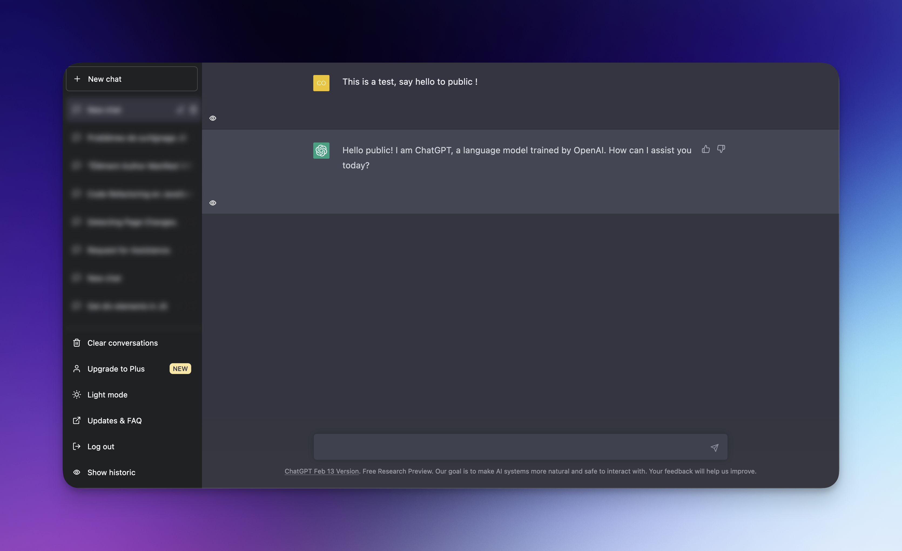

# ChatTools

This is a simple web extension that allows you to easily hide or show your conversation history, expand or collapse a block chat, on chatGPT.
# Installation

   [Firefox extension v1.0](https://addons.mozilla.org/fr/firefox/addon/chattools/)
   
   [Chrome extension v1.0](https://chrome.google.com/webstore/detail/nckgcgkfgoghbiklepnmppjlencpkffd)

# Usage

Once installed, you will notice a new button added to your ChatGPT interface. Clicking on this button will toggle the visibility of your browsing history.

The button is labeled with "Show historic" when the history is hidden, and "Hide historic" when it's visible.

By default, the history will be hidden when load page ChatGPT.

v1.1 - Now you can expand/collapse block chat individually by simply click on the show/hide icon at the bottom left of the block chat.

# Test

    - Clone the repository or download the zip file and extract its content to a folder.
    - Open Chrome and go to chrome://extensions or about:debugging (Firefox).
    - Enable the "Developer mode" toggle at the top-right corner.
    - Click on "Load unpacked" and select the folder containing the extension files.
    - The extension should now be installed and ready to use.
    
    

